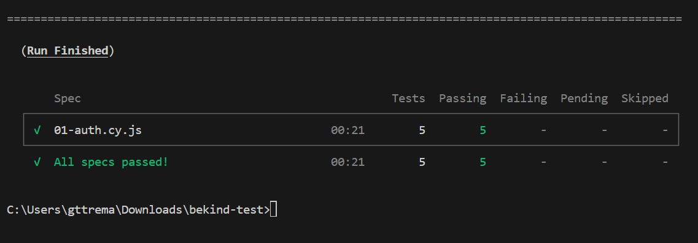
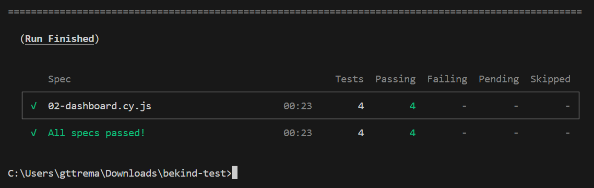

# 🧪 Cómo Correr los Tests

## Paso 1: Preparar todo
```bash
# Instalar dependencias (solo la primera vez)
npm install
# Levantar la aplicación
npm run dev
```
Verifica que la app abra en: `http://localhost:5173`

---

## Paso 2: Ejecutar los tests
```bash
# En otra terminal (deja la app corriendo)
npx cypress open
```

Después:
1. Click en "E2E Testing"
2. Selecciona "Chrome"
3. Click en el test que quieras ver (ejemplo: `01-auth.cy.js`)
---
## Autenticación
**C:\Users\gttrema\Downloads\bekind-test\cypress\e2e\01-auth.cy.js**


## Dashboard
**C:\Users\gttrema\Downloads\bekind-test\cypress\e2e\02-dashboard.cy.js**


## Paginación
**C:\Users\gttrema\Downloads\bekind-test\cypress\e2e\03-paginacion.cy.js**


## Crear Acción 
**C:\Users\gttrema\Downloads\bekind-test\cypress\e2e\04-crear-accion.cy.js**
