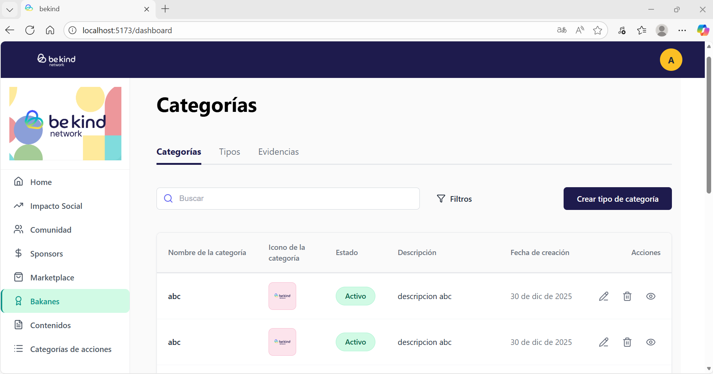

# 🌟 Be Kind Network

¡Hola!👋 esta es la prueba técnica Frontend para el proceso de selección en Lógika.

Es una aplicación web en React que consume APIs REST, maneja autenticacion, estado, formularios y buenas practicas de arquitectura/UI.



---
## ✨ Características Implementadas
**1. Autenticación**
- Login con email y contraseña
- Guardado de token en localStorage
- Loader mientras se autentica
- Mensajes de error claros
- Validaciones del formulario (email válido, contraseña requerida)

**2. Dashboard con listado**
- Tabla con todas las acciones
- Paginación funcional (10 items por página)
- Estados de carga: loading spinner, error, lista vacía
- Token enviado automáticamente en cada petición

**3. Crear nueva acción**
- Formulario completo con 5 campos:
  - Nombre (mínimo 3 caracteres)
  - Descripción (10-200 caracteres con contador)
  - Icono (subir imagen)
  - Color (formato HEX con preview)
  - Estado (activo/inactivo con toggle)
- Validaciones en tiempo real
- Upload de archivos funcional
- Refresca la lista automáticamente después de crear

### Extras que agregué 
- **Eliminar acción**: Con modal de confirmación para no borrar por error
- **Cerrar sesión**: Botón de logout que limpia el token
- **Toggle password**: Botón para ver/ocultar la contraseña
- **Manejo de errores 401**: Si el token expira, te saca al login
- **Pruebas E2E**: tests con Cypress 

---

## 🛠 Tecnologías que usé

### Lo principal
- **React 18** - Para construir la interfaz
- **TypeScript** - Para tener código más seguro con tipos
- **Vite** - Para desarrollo rápido (mucho más rápido que Create React App!)

### Manejo de estado y formularios
- **Zustand** - Para guardar el token de forma global 
- **React Hook Form + Zod** - Para los formularios y validaciones

### Para conectarme con el API
- **Axios** - Para hacer las peticiones HTTP
### Otras herramientas importantes
- **React Router DOM** - Para la navegación entre páginas
- **Lucide React** - Para los íconos
- **Cypress** - Para las pruebas automatizadas

---

## 🚀 ¿Cómo empezar?

### Lo que necesitas tener instalado

- Node.js (versión 16 o superior)
- npm (viene con Node.js)
- Un navegador moderno (Chrome, Firefox, Edge)

### Paso 1: Clonar el proyecto

```bash
git clone https://github.com/gtrejos/Bekind-test.git
cd Bekind-test
```

### Paso 2: Instalar dependencias

```bash
npm install
```

_Esto va a tardar unos minutos la primera vez ☕_

### Paso 3: Correr el proyecto

```bash
npm run dev
```

¡Listo! 🎉 Abre tu navegador en `http://localhost:5173`

### Credenciales para probar

```
Email: email de acceso
Password: contraseña de acceso
```

---

## 🧪 Pruebas automatizadas

Escribí 21 pruebas automatizadas con Cypress que cubren todo el flujo de la aplicación.

### ¿Cómo correr las pruebas?

**Opción 1: Ver las pruebas corriendo (modo visual)**

```bash
# Terminal 1: Levanta el proyecto
npm run dev

# Terminal 2: Abre Cypress
npx cypress open
```

Después selecciona "E2E Testing" → "Chrome" → Click en el archivo que quieras probar

**Opción 2: Correr todas las pruebas (modo terminal)**

```bash
# Terminal 1
npm run dev

# Terminal 2
npx cypress run
```

### ¿Qué prueban?

- ✅ Login con credenciales válidas e inválidas (4 tests)
- ✅ Protección de rutas (si no hay token, te saca al login)
- ✅ Cargar el listado de acciones (4 tests)
- ✅ Paginación (cambiar de página, botones deshabilitados, etc.) (4 tests)
- ✅ Crear una acción nueva completa (6 tests)
- ✅ Eliminar una acción (2 tests)
- ✅ Cerrar sesión (1 test)

---

## 📁 Estructura del Proyecto

```
src/
├── api/                      
│   ├── actions.ts           
│   └── auth.ts 
│   └── client.ts              
├── components/              
│   ├── Button.tsx
│   └── CreateActionModal.tsx  
├── pages/                   
│   ├── Dashboard.tsx
│   ├── Login.tsx
│   └── CreateAction.tsx
├── store/                   
│   └── authStore.ts        (Zustand)
├── styles/                 
│   ├── App.css
│   ├── Dashboard.css
│   ├── CreateActionModal.css
│   └── ConfirmDialog.css
│   └── index.css
├── types/                   
│   └── index.ts
├── App.tsx                 
└── main.tsx               

cypress/
├── e2e/                   
│   ├── 01-auth.cy.js
│   ├── 02-dashboard.cy.js
│   ├── 03-paginacion.cy.js
│   ├── 04-crear-accion.cy.js
│   ├── 05-eliminar.cy.js
│   └── 06-logout.cy.js
└── support/           
    └── commands.ts
```

---


## 💭 Reflexiones finales

Este proyecto fue un gran ejercicio para practicar:
- Consumo de APIs sin documentación completa
- Manejo de estado global con Zustand
- Validaciones de formularios complejas
- Testing E2E real

**Lo que más disfruté**: Hacer que el preview del color funcionara en tiempo real y escribir las pruebas de Cypress (¡es satisfactorio ver los tests pasar! ✅)

**Lo que aprendí**: A investigar APIs probando y documentando, y a ser más cuidadosa con los tipos en TypeScript.

**Si tuviera más tiempo**: Implementaría edición de acciones, búsqueda en tiempo real, y optimistic UI updates.

---

## 🙏 Gracias

Gracias por tomarte el tiempo de revisar mi código. Espero que el README te haya ayudado a entender mis decisiones y cómo funciona todo.

Si tienes preguntas o sugerencias, ¡estaría feliz de escucharlas!


Gissell Tatiana Trejos Marín
Tel: 3218495200 

---

